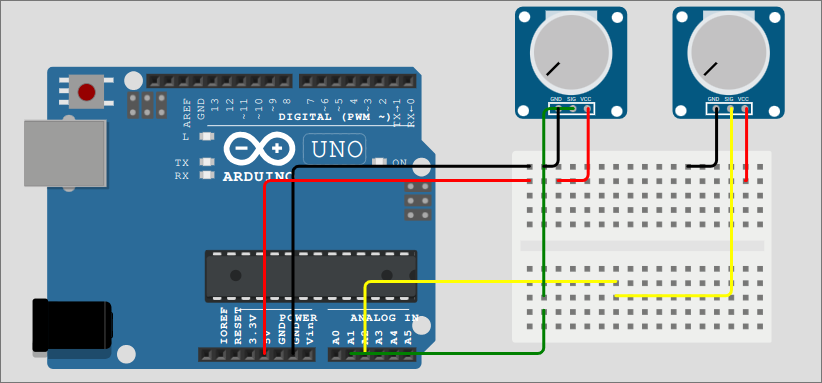

# Etch A Sketch Arduino

Simple game ispired by real toy Etch A Sketch. Using 2 potentiometer as pointer then arduino will convert the pulse to coordinate before send to Serial port. Processing receiving data from Serial then use that for visualize the pointer.
## Device

Board : [Arduino UNO R3](https://docs.arduino.cc/hardware/uno-rev3/)

Component : Potetntiometer 10k

## Wiring

## Usage
1. Upload EtchASketch.ino program (do not run serial monitor)
2. Run ProcessingASketch.pde
